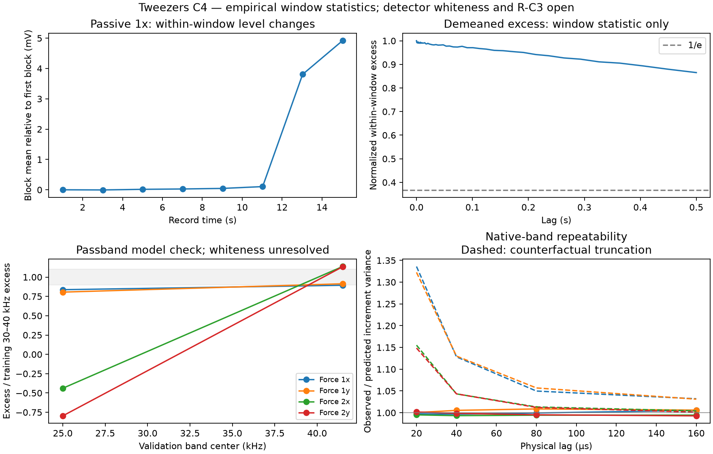

# Tweezers C4 — scoped excess motion; detector whiteness remains unresolved

**Empirical, revised after PR #13 review.** Passive Force 1x's second half is
compatible with an additive slow component: short-lag diffusion is 1.059 of
calibration, within the unchanged 8% residual tolerance. Its **within-window,
sample-mean-removed excess RMS is 2.402 mV** over **8.017–16.034 s**. The excess
covariance has no 1/e crossing through **0.500 s**. These are descriptive window
statistics, not a population variance, stationary timescale, or identified cause.
The original unique-physical-attribution reading is withdrawn because theta is
unstable even on the control.

On the four-axis 100 kHz record, the registered subtraction omitted the anti-alias
transfer and tested across its stopband. **That test cannot decide detector-floor
whiteness.** Revised passband comparisons also leave the composite model unresolved;
all `sigma_obs_V` values remain null. The trained native-band PSD predicts the
other half's increment moments accurately, which measures temporal spectral
repeatability—not Retention's unknown above-Nyquist extrapolation. **R-C3 remains
open**, without a stage-unit assumption or a new drive measurement.

Registration and amendments: [TWEEZERS_C4_REGISTRATION.md](TWEEZERS_C4_REGISTRATION.md).
Final artifact: `experiments/results/tweezers_c4.json`. The pre-review result is
preserved at commit `ca424ca`; earlier failed reads remain in
`tweezers_c4_initial.json` and `tweezers_c4_stored_diode.json`. Artifacts carry input
hashes, calibration provenance, sample rates, and temporal fit/evaluation domains.

## 1. What the new signature does—and what theta instability prevents

`attribute_deviation` adds `(free theta, 1, 1+v)`: the variance coordinate fits
v and short-lag diffusion supplies the remaining prediction. **Theta is neither
predicted nor used to admit this hypothesis.** A separately named, reported
`CONTAMINANT_VARIANCE_FLOOR = 0.08` controls materiality; `tol = 0.08` controls
residual acceptance. The values currently coincide but changing tol no longer
changes materiality. The floor and distance to it are reported; there is no
undeclared uncertainty interval or hysteresis. A smaller component can be
undetermined at this declared floor, not asserted absent.

The first implementation admitted a 3.8% control excess and incorrectly called
it contamination. The retained initial artifact motivated materiality gating.
The review then exposed the unjustified theta<1 admission gate; it is removed.
Tests cover either side of theta=1 and the variance floor, including explicit
changes to the separately declared floor.

Each half now calls **axis_gate first**, retaining its result. Failed gates still
prevent a stochastic law certificate; C4's subsequent diagnostics do not override
them. A thermal PSD fit on the other half supplies the thermal rate for short-lag
inversion. Frozen strides 2,3,4,6,8 are restricted to theta_thermal*tau <= 0.3.
Missing fits, missing/nonpositive ACF rates and empty stride sets refuse with
reasons instead of crashing.

| axis / evaluation half | gate | apparent theta ratio | b² ratio | Var ratio | signature result |
|---|---|---:|---:|---:|---|
| 1x, first | pass | 1.166 | 1.010 | 0.986 | unattributed |
| 1x, second | fail | 0.0139 | 1.059 | 4.938 | slow-compatible, 5.88% diffusion residual |
| 1y, first | pass | 1.215 | 1.018 | 0.989 | unattributed |
| 1y, second | fail | 0.558 | 1.027 | 1.038 | unattributed |

The gate's historical timescale factor 1.25 is not the attribution residual bar
0.08. Apparent/thermal and thermal/calibration rate ratios are now explicit in
the artifact, along with half-to-half theta spread. The control's **1.215 vs
0.558** exceeds the decision tolerance by a large margin. Theta-constrained
rivals are penalized by an unstable observable while the slow signature leaves
it free. Consequently its positive result establishes **signature compatibility
only**, not a fair uncertainty-calibrated victory over physical alternatives.
No process-rate uncertainty model was invented to force attribution.

A stiffness decrease `(c,1,1/c)` overlaps the slow signature exactly at
**theta*Var=1**, with diffusion unchanged; finite tolerance thickens that set.
Away from that relation, stiffness can fail while the slow signature passes.
This explains the ambiguity rather than asserting that every slow contaminant
is a stiffness change. Stiffness increases remain reachable and are tested.
The old C3 triple `(0.0185,0.8851,3.7967)` still refuses at its 11.5% diffusion
residual. Replaying C3's frozen ratios preserves its control and active drag
verdicts (see §6).

## 2. The amplitude belongs to a demeaned window

Observed covariance is computed after subtracting the evaluation window's sample
mean. The revised subtraction applies the **same finite-window mean-removal
operator to the thermal model covariance**, rather than subtracting a population
thermal covariance. The thermal mean correction is small here (1.16e-10 V²),
but making the estimators match removes an avoidable bias.

| second-half descriptive quantity | value |
|---|---:|
| within-window observed variance | 7.2483e-6 V² |
| within-window excess variance | **5.7689e-6 V²** |
| within-window excess RMS | **2.40185 mV** |
| RMS sensitivity to four other training-block thermal fits | 2.38169–2.41287 mV |
| RMS with declared diode only, omitting the clipped attenuation factor | 2.40169 mV |
| first 1/e crossing of the window excess covariance | absent through 0.499994 s |
| minimum normalized covariance in that lag window | 0.8643 |

**Neither sensitivity range is total uncertainty.** Sample-mean removal also
removes an unknown part of the slow component. Under a stationary model its
expected variance deficit is Var(sample mean), dependent on that component's
unmeasured covariance over the whole window. The unknown slow-process contribution
is not corrected, bounded or hidden inside a narrow thermal-fit error bar.
Population variance is explicitly null. The crossing bound describes this
empirical window function, not a lower confidence bound on a latent timescale.

`Retention.measured` is clipped to [0,1]; it cannot identify an additive excess
separately from transfer. The artifact therefore names that conditional response
model and reports the diode-only alternative above. Their small difference on
this particular statistic does not establish the true response or bound all
model error. Observed covariance is cached across sensitivity subtractions;
unresolved/negative alternatives are counted and carry reasons, not indexed as
though an RMS always exists.

Across evaluation blocks, variability is much larger than thermal sensitivity.
The mean is nearly constant through 12 s, changes in 12.025–14.030 s, and ends
**4.921 mV** above the first block. This supports describing a late excursion or
level shift. A stationary whole-record amplitude/timescale interpretation remains
killed; electronic, mechanical and other physical causes are not distinguished.

## 3. Noise-record provenance

`noise_floor.h5` contains four trapped-bead channels, each **1,000,139 samples
at 100 kHz**, not a detector-only record. The old screening script/artifact already
included Force 1x. The sole calibration predates this acquisition, has backing=0
and chi²/dof 73–101, and is not its thermal truth key.

The [producer tutorial](https://lumicks-pylake.readthedocs.io/en/v1.8.0/tutorial/force_calibration/diode_model.html)
uses a pre-calibrated diode model at the record's diagnostic power. Stored powers
0.118/0.256 V differ from Diagnostics 0.362/0.782 V. Evaluating the stored
`max - delta exp(-rate*mean(power))` model gives alpha/diode frequency
**0.44893 / 14829.5 Hz** for trap 1 and **0.54511 / 14621.9 Hz** for trap 2.
The [producer implementation](https://github.com/lumicks/pylake/blob/main/lumicks/pylake/force_calibration/calibration_models.py)
was inspected rather than fitting the diode to the validation residuals.
Explicit provenance checks reproduce the stored parameters at stored power;
they raise under `python -O` too. Failure is reported per axis. Volts now come
directly from the shared applied-calibration adapter, avoiding an nm round trip.

## 4. Corrected noise experiment: repeatability, passband tests, and rolloff

Thermal Lorentzian*diode parameters come from half 1 at **100–2300 Hz**. A constant
N is estimated from its **30–40 kHz** residual. The other half at that same band
measures **temporal repeatability only**; it never votes in validation.

The first implementation also included that band in a three-band AND, despite
registering two validation bands. That was a **protocol violation**. The prior
claim that no test band fitted its own correction was misleading and is withdrawn.
Distinct temporal halves do not reuse the same observations, but that fact does
not make same-frequency repeatability a new spectral test. This revision reruns
a separately registered exploratory protocol and leaves the original result
superseded rather than marking its prediction as met.

Review identified the original 40–48 kHz band as crossing rolloff near 43 kHz.
Subtracting thermal*diode **without anti-alias attenuation** there makes a falling
PSD look like negative additive noise. It cannot reject detector whiteness. The
new passband test is **20–30 and 40–43 kHz**, at the original 10% bar. Above 43 kHz
is reported only as rolloff diagnostics. We do not use `rt.measured` as an
independent correction: it is inferred from the noisy PSD and clipped, so using
it would not separately identify the transfer and detector noise.

| axis | training N (V²/Hz), 30–40 kHz | held-out same-band repeatability / N | validation residual / N: 20–30, 40–43 kHz |
|---|---:|---:|---|
| 1x | 2.0167e-13 | 0.999 | 0.837, 0.894 |
| 1y | 1.9343e-13 | 1.007 | 0.805, 0.913 |
| 2x | 1.0002e-13 | 1.009 | −0.439, 1.137 |
| 2y | 8.6227e-14 | 1.016 | −0.796, 1.133 |

For 1x, residual/N falls from **0.894** at 40–43 kHz to **0.242** at 43–45,
**−0.081** at 45–48 and **−0.092** at 48–50. That is consistent with the omitted
transfer becoming dominant; it is not evidence of negative detector noise.

All four **composite-model passband tests** still fail at least one band.
Unknown transfer and thermal-model error prevent identifying detector whiteness
even inside this selected passband; the 20–30 kHz trap-2 residuals show the
thermal model itself overshooting. **Whiteness is unresolved**, not established
or rejected. `sigma_obs_V` remains null even if a composite passband test were to
pass. No scalar noise is injected into Ito rows or transferred between records.
The logged thermal+constant-floor moment calculation remains an explicitly
incomplete-transfer counterfactual, not a corrected detector model.

## 5. What the decimation calculation actually establishes

Unfiltered `held[::2]` makes each decimated increment exactly a subset member
of the native increments at twice the stride. Comparing their mean squares is
a **subsample consistency check**, not an independent sampling experiment.
Subsample and full means need not agree for arbitrary nonstationary/parity-
structured data; their observed agreement is nevertheless not validation of
aliasing or above-native-Nyquist content.

The PSD of half 1, integrated over its **native recorded 0–50 kHz band**, predicts
half 2's increment variance within **0.87%** over the reported axes/lags. This is
a useful check of temporal spectral repeatability. It samples no unknown power
above the original 50 kHz Nyquist and does **not validate `Retention._full`**.

Discarding the portion above 25 kHz reduces the computed shortest-lag integral
by **13–25%**. Those are counterfactual truncation fractions, not observed lost
power from a second acquisition. Artifact fields and figure labels now state
these interpretations directly. The earlier README and PR claims of isolated
sampling/alias validation are withdrawn.

The independent 78.125 kHz recordings differ in bead, power, diode and acquisition.
Their Retention factors remain a descriptive cross-record comparison. They do
not provide the matched analog acquisition or independently measured transfer
needed to validate the model's full-band extrapolation.

## 6. Historical artifacts, reproduction, and R-C3

`experiments/results/tweezers_c3.json` is a **frozen historical output from commit
489bd97**, not a promise of byte-identical current execution. Current `run_c3.py`
writes `tweezers_c3_current.json` to avoid overwriting it. C4 does not run that
historical stage-unit-assuming calculation. Instead it writes
`tweezers_c3_attribution_replay.json`, recording the old and current classifier
outputs on the frozen ratios, source hash and replay scope. The four axis verdicts
remain unchanged while the hypotheses/notes may differ.

Run `.venv/bin/python experiments/tweezers/run_c4.py`, then optionally
`.venv/bin/python experiments/tweezers/plot_c4.py`. Failed axes and missing
covariance estimates remain visible in the figure rather than crashing plotting.
No paid proposer, new dataset download, or new certificate is involved.

**R-C3 remains open:** no stage length unit, second drive frequency, revised
active drag estimate, or resolution of the 13% disagreement was supplied. All
claims here are empirical window/model diagnostics or explicitly open. Nothing
is promoted to `proved`.

Revised validation: 25 C4 tests and 21 instrument tests passed, each file in
its own process. New checks cover training-band exclusion from validation,
rolloff exclusion, absent ACF/empty strides/failed fits, unresolved sensitivity,
stiffness increases, free-theta admission, mean-removal matching, explicit diode
provenance under python -O, direct voltage conversion, and unresolved plotting.
Ruff F,E9 and diff whitespace checks passed. The revised real-data artifact and
figure were regenerated; no full-suite or new certified-physics claim is made.
